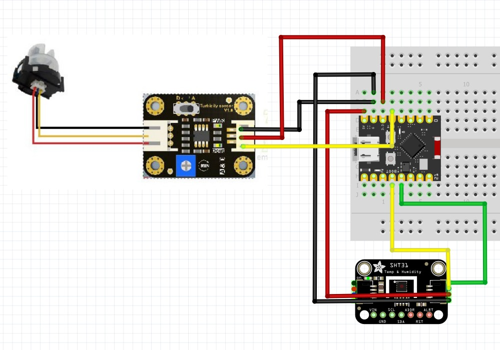
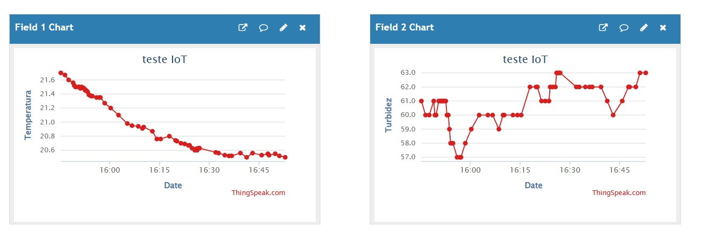

#  Projeto Garrafa Verde

Sistema de monitoramento da **temperatura** e da **turbidez** de rios e lagos utilizando Internet das Coisas (IoT).

---

##  Sobre o Projeto

O **Projeto Garrafa Verde** foi desenvolvido com o objetivo de monitorar a qualidade da água em rios e lagos por meio da medição da **temperatura** e da **turbidez**.

Para isso, um **ESP32-C3 Mini** realiza a leitura dos sensores conectados ao sistema e envia os dados coletados para a plataforma **ThingSpeak** utilizando uma conexão Wi-Fi. Os dados ficam disponíveis em um dashboard, permitindo o acompanhamento remoto e em tempo real das condições monitoradas.

---

##  Objetivos

- Monitorar a temperatura da água;
- Monitorar a turbidez da água;
- Enviar os dados para a nuvem utilizando IoT;
- Exibir os dados em tempo real através do ThingSpeak.

---

#  Componentes Utilizados

 Componente = Função 

 ESP32-C3 Mini = Aquisição dos dados, processamento e envio ao ThingSpeak 
 
 Sensor SHT31 = Temperatura 
 
 Sensor de Turbidez DigiKey V1.0 = Medição da turbidez 
 
 ThingSpeak = Plataforma IoT para armazenamento e visualização 

---

#  Funcionamento

O sistema realiza continuamente a leitura dos sensores.

1. O sensor **SHT31** realiza a leitura da temperatura da água.
2. O sensor de turbidez mede o nível de partículas presentes na água.
3. O **ESP32-C3 Mini** recebe os dados dos sensores.
4. O microcontrolador processa as informações coletadas.
5. O ESP32 conecta-se à rede Wi-Fi.
6. Os dados são enviados para a plataforma **ThingSpeak**.
7. As informações podem ser visualizadas em tempo real por meio do dashboard do ThingSpeak.

---

#  Esquema de Ligação

A figura abaixo apresenta a montagem do circuito utilizada durante o desenvolvimento.

---

#  Monitoramento

Os dados enviados podem ser visualizados diretamente na plataforma ThingSpeak.

Acesse o dashboard público do projeto:
https://thingspeak.mathworks.com/channels/3430238

---

#  Autores

- Bruna
- Giovanna
- Gabryella
- Stefany

---

# Data

21/07/2026

